# VADD user guide

How to run an objective from a one-sentence description to a proven commit — and what every
screen along the way is telling you.

For the design behind it, see the [specification](spec.md). For every configuration surface,
see [configuration](configuration.md).

---

## Install

```sh
npx @vadd/cli
```

A server starts on `http://127.0.0.1:4319/` and your browser opens on it.

You need Node.js 22 or newer, and one of the supported agents already installed and logged in
on this machine:

- **Claude Code** — VADD reuses the credentials your `claude` login created.
- **Codex CLI** — VADD reuses the credentials your `codex login` created.

VADD ships no model access and never asks for an API key of its own.

> If you launch VADD from inside a Claude Code terminal, the adapter refuses to start: a
> Claude Code session's own environment variables block it. Start VADD from an ordinary
> terminal instead.

---

## 1. Add a project

**Add project** in the sidebar takes either a local path or a repository URL, and asks which
agent should drive it. A cloned repository is validated before git ever sees the URL — see
[the network posture](spec.md#11-security-privacy-and-network-posture) if you want to know
exactly what is accepted.

VADD works out how this repository is verified as soon as you add it: it reads
`.vadd/config.json` if the repository has one, and otherwise looks for `test`, `lint` and
`build` scripts at the root and one directory down. You can see and change the result when you
create an objective. Writing the config file is worth doing — it is the difference between
VADD checking what *you* consider proof and VADD guessing.

---

## 2. Create an objective

An objective is one unit of work, described in plain language. Three modes:

| Mode | Path | Use it for |
|---|---|---|
| **Standard** | explore → propose → decide → plan → execute per task → verify → review → integrate | anything with a real decision in it |
| **Fast Fix** | explore → plan → execute → verify → review → integrate | small, low-risk changes. Skips the decision step; **never** skips verification |
| **Investigation** | read-only, ends in a report rather than a commit | "why does this happen?", where you do not want anything changed |

Each objective gets its own git worktree and branch. Nothing touches your checkout until you
choose to integrate.

---

## 3. The board

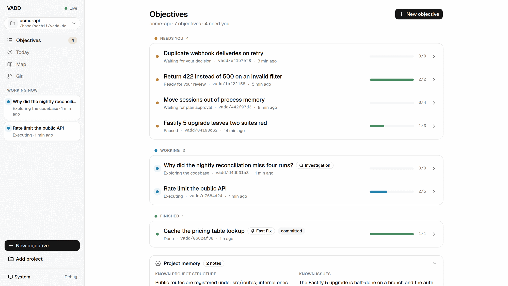

Objectives are grouped by what they want from you:

- **Needs you** — a decision, a plan, a review, or a paused objective waiting on a person.
- **Working** — an agent turn is in flight right now.
- **Finished** — done, cancelled or abandoned, with how it was integrated.

Every row carries a status dot, the state in plain words, the branch, and a `verified/total`
bar. The sidebar repeats anything currently working and counts what needs you, so you can
leave the page and still know when to come back. **Project memory** below the list is what
VADD has learned about this repository across objectives; it is fed into the first prompt of
every new one.

The theme follows your system setting, and there is a manual toggle in the header.

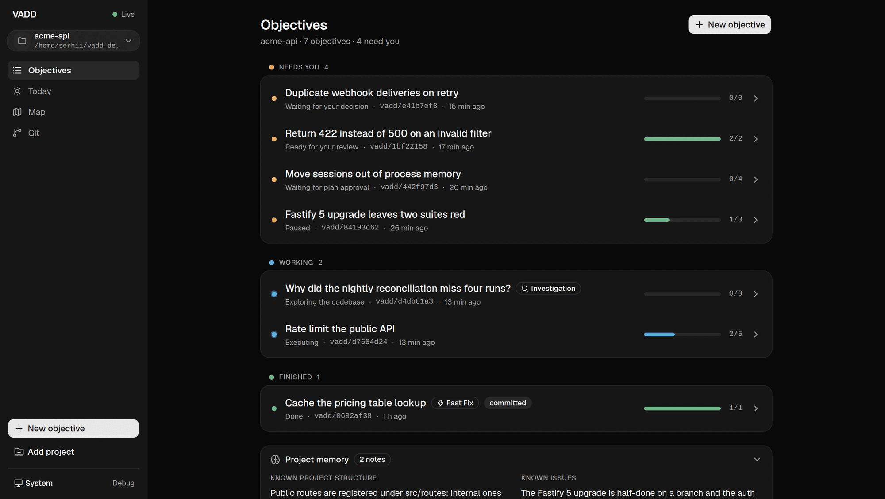

---

## 4. Answering a decision

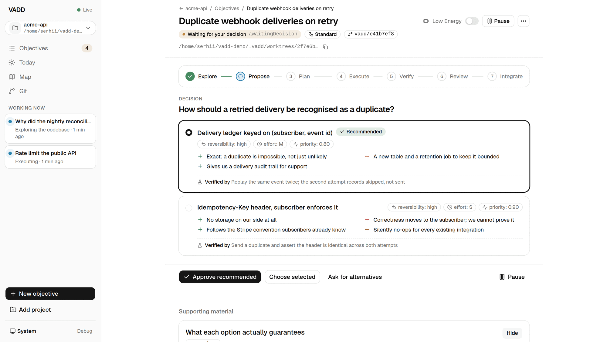

When the agent finds a real fork in the road, it stops and asks. Each option shows its pros
and cons, how reversible it is, an effort estimate, and — the field that matters most — **how
the option would be verified** if you picked it.

The priority score beside each option is computed from those same fields; it is a sort order,
not a verdict.

Your four moves are: approve the recommendation, choose a different option, ask for
alternatives, or pause.

Beneath the card, the agent can attach **supporting material** — small typed cards: a
comparison table, a code sketch, a diagram, a short note. They are capped small on purpose. A
card is a sketch that helps you decide, never a document to read.

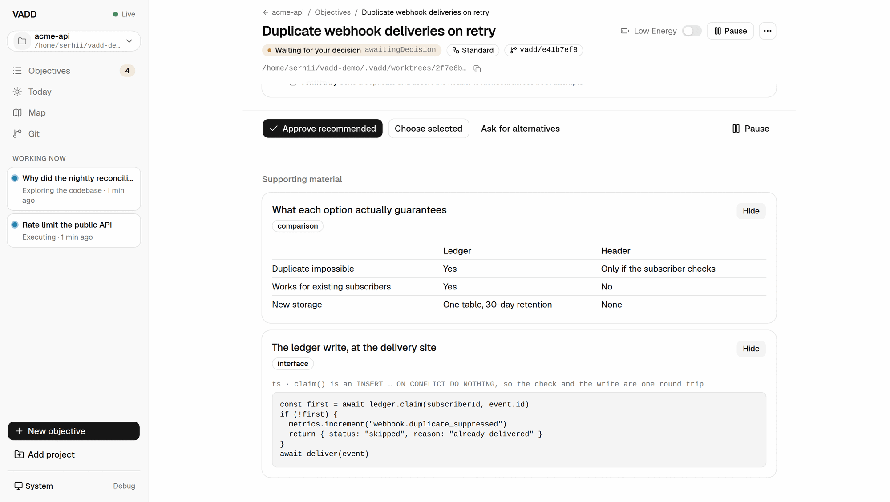

---

## 5. Approving a plan

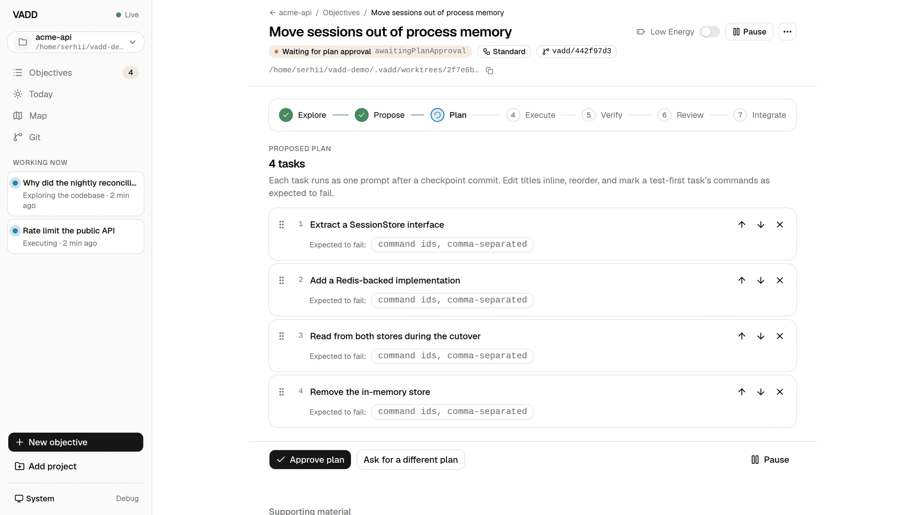

The plan is a list of tasks, each of which will run as **one prompt, preceded by its own
checkpoint commit**. That is what makes a rollback cheap and precise later.

You can reorder tasks, drop them, and mark a task's commands as **expected to fail** — which
is how you let a genuine test-first step go red without weakening the rule that a green
evidence set is required before `done`.

If the plan is wrong in kind rather than in detail, **Ask for a different plan** sends it back
with your instruction rather than making you edit it into shape.

---

## 6. While it works

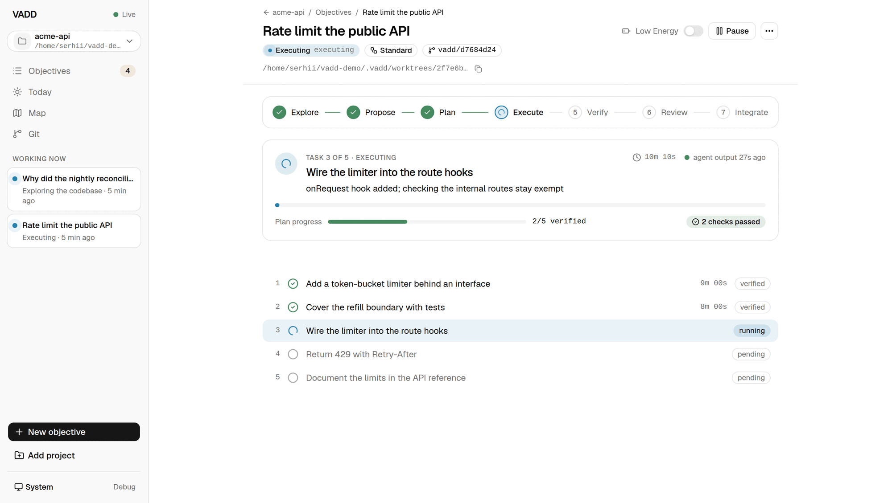

There is no log stream, and that is the point. The live card shows which task is running, how
long it has been running, the agent's own last one-line status, and how much of the plan is
verified.

If nothing has arrived from the agent for a minute, a notice says so and offers the raw
transcript and a pause — a long test suite looks exactly like a stuck agent otherwise, and
VADD would rather tell you which one it cannot distinguish than show you a spinner.

**Raw transcript** is always one click away, on every screen. It is never the primary surface,
and it is never removed.

---

## 7. Reviewing the evidence

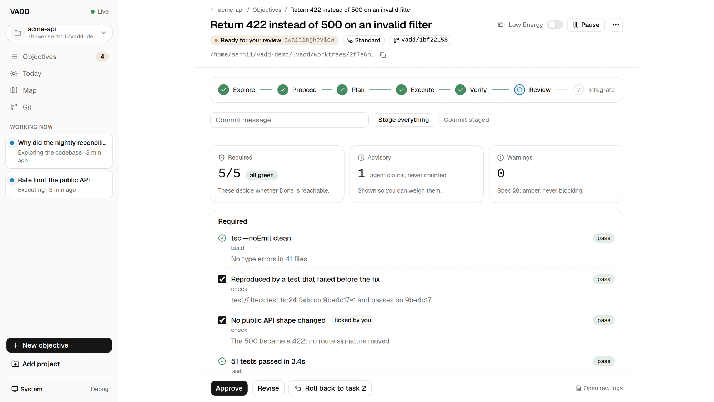

When a task finishes, VADD runs the repository's verification commands **itself** — not the
agent — and reconciles the results against the spec.

Three groups:

- **Required** — these decide whether `done` is reachable. Each row is a command VADD ran, or
  a checklist item.
- **Advisory** — evidence the agent produced about its own work. Shown so you can weigh it,
  never counted.
- **Warnings** — amber, never blocking.

A checklist item is satisfied either by the agent explicitly attesting to it, or by you
ticking it — and a tick is labelled *ticked by you*, permanently, because a claim and a proof
should never look the same.

From here: **Approve** the task, **Revise** it with an instruction, or **Roll back** to a
named checkpoint.

---

## 8. When it stops

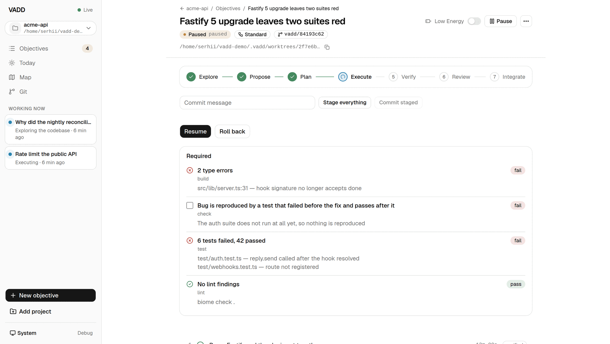

Verification that leaves a required command red does not enter review. The objective stops and
shows you exactly which command failed and what it said.

You can resume it, roll back to a checkpoint, tick a check by hand if the failure is not the
one it looks like, or open the git console and fix something yourself. If the objective
stopped because something went *wrong* — an agent crash, a timed-out turn, a setup command
that failed — the reason is shown as a banner in plain words rather than left in a log.

---

## 9. Integrating

Once every required item is green, you choose what happens to the work:

- **Commit** — squash the checkpoint commits into one commit on the objective's branch, then
  release the worktree.
- **Keep** — leave the branch and the worktree alone; you will deal with it yourself.
- **Discard** — remove both.

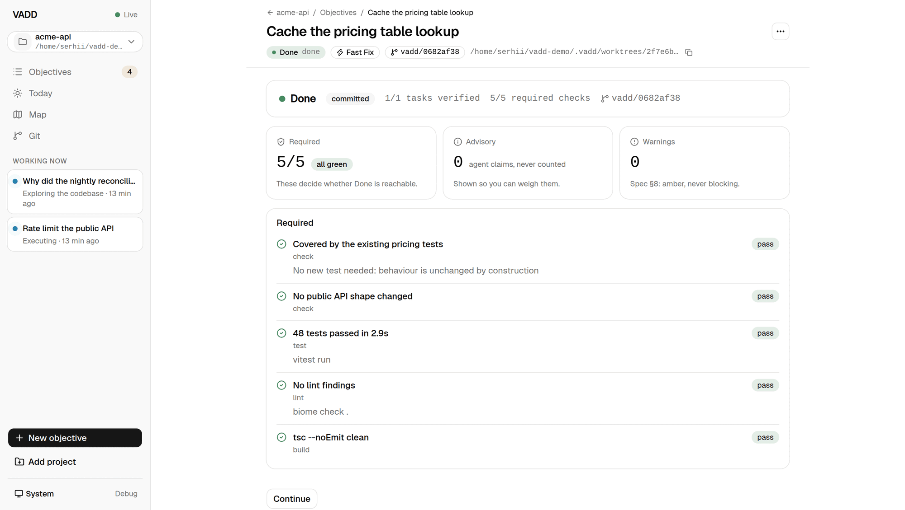

A finished objective keeps its full evidence set, read-only, so "why did we believe this was
done?" has an answer months later. **Continue** starts a follow-up objective branched from
this one's own branch, so a two-part job stays one line of work.

Any commit VADD creates is re-checked against your `policy.protectedGlobs`. A protected path
is excluded from the commit and **named** in the objective's events — a squash that silently
omitted a file the agent believed it had changed would be the same class of lie as a dropped
event.

---

## 10. Low Energy Mode

The header toggle, per objective. It hides the secondary task list, suppresses non-blocking
notifications, collapses supporting material to its titles, and lets a low-risk task or a
simple Fast Fix plan approve itself under the policy you configured — with a banner naming
what was auto-approved and an undo beside it.

Nothing about the evidence guard changes. Auto-approval dispatches the same event your click
would have; it cannot make `done` reachable on a red set.

---

## 11. The git console

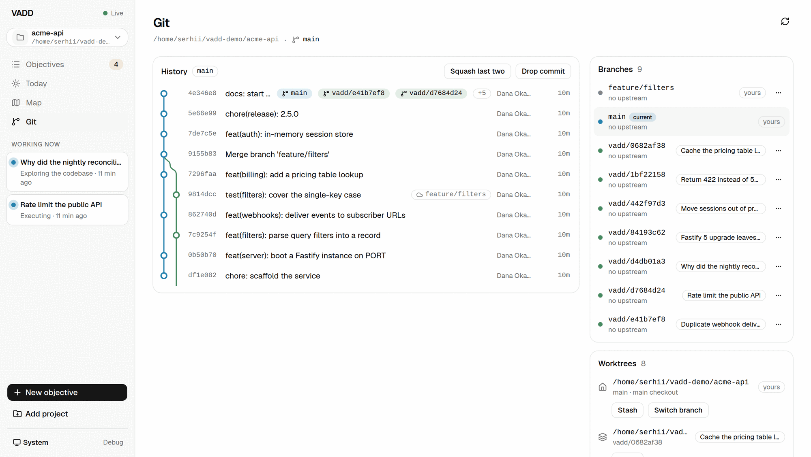

VADD is not a git client, but an objective leaves branches and worktrees behind, and pretending
otherwise just means switching to a terminal at the worst moment.

The console shows a real commit graph, the branches and worktrees VADD owns alongside your
own, and — behind a disclosure and a confirmation on each — stage, unstage, discard, commit,
amend, squash, reword, drop, stash, branch, checkout, worktree create and remove. Every
mutation records a **one-step undo**, and the banner tells you what it would restore.

Four operations touch the network, all against remotes your repository already has: fetch,
fast-forward pull, push, and listing remotes. There is no force push, no non-fast-forward
pull, and no way to add or point a remote somewhere new from this screen.

Some things are refused outright rather than confirmed: a mutation while an objective's agent
holds the worktree, switching an objective's branch, and removing an objective's worktree.
Those go through the objective, which knows what it is in the middle of.

**Stray worktrees** — directories left behind by a failed removal, which `git worktree list`
cannot show you because git already dropped the registration — are detected here and can be
released.

---

## 12. The map and the daily summary

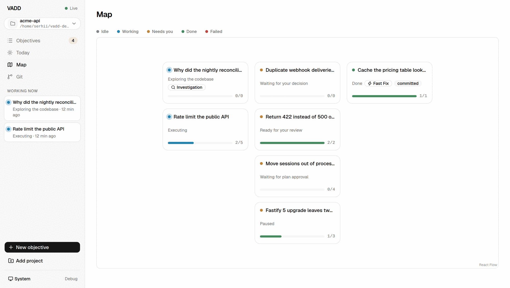

`/map` lays the project's objectives out in five status columns: idle, working, needs you,
done, failed. It is a wider view of the board, useful when several objectives are open at once.

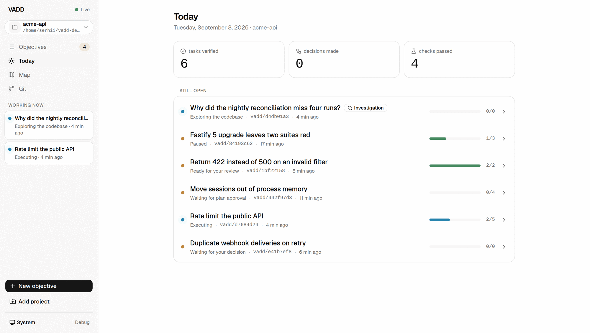

`/today` counts verified outcomes, decisions made and checks passed, and lists what is still
open. Text only, no streaks, no scores.

---

## 13. Telling VADD what "proven" means

The single highest-value thing you can do for a repository is commit a `.vadd/config.json`:

```json
{
  "verify": {
    "setup": [{ "id": "deps", "run": "pnpm install --frozen-lockfile" }],
    "commands": [
      { "id": "test", "run": "pnpm test", "required": true },
      { "id": "lint", "run": "pnpm lint", "required": true, "allowWarn": true },
      { "id": "typecheck", "run": "pnpm typecheck", "required": true }
    ],
    "checks": [
      "Bug is reproduced by a test that failed before the fix and passes after it"
    ],
    "timeoutSec": 600
  },
  "policy": {
    "protectedGlobs": ["**/migrations/**", ".env*"],
    "maxFastFixLines": 150
  }
}
```

Every field is documented in [configuration](configuration.md). Three that repay attention:

- **`setup`** runs once per worktree, at creation. A fresh worktree has no `node_modules` and
  no `vendor`; an agent asked to work test-first cannot run a test without this.
- **`required: false`** on a slow command keeps it visible without letting it block `done`.
- **`protectedGlobs`** is enforced on every commit-creating path, not just the final squash.

### A security review, with no VADD update

VADD ships no security scanner. It does not need to: a real scan is a command and an OWASP
review is a check.

```json
{
  "verify": {
    "commands": [
      { "id": "audit", "run": "pnpm audit --audit-level=high", "required": true }
    ],
    "checks": [
      "OWASP checklist reviewed: injection, broken auth, sensitive data exposure, access control — no obvious issues found in this change"
    ]
  }
}
```

The audit runs for real and its evidence is classified as `security` in the panel. The
checklist item is satisfied by the agent's own attestation, the same way any other check is —
a claim, not proof, since no tool catches every class of issue a checklist names.

---

## 14. Troubleshooting

**The agent will not start.** The Claude Code adapter refuses to run if it inherits a Claude
Code session's own environment variables. Launch VADD from an ordinary terminal.

**An objective is stuck in "Setting up".** Its `verify.setup` commands are still running, or
one failed. A failed setup leaves the objective in a permanent state that keeps the failure
log as an evidence row — read it, fix the command, and create a new objective.

**"This worktree directory no longer exists."** Something removed the directory outside VADD.
Release it from the git console; the objective's diff, rollback and integration cannot work
until you do.

**Verification found nothing to run.** VADD says so explicitly rather than reporting an empty
set as green. Add a `.vadd/config.json`.

**A block the agent emitted did not parse.** VADD records it as a contract violation and
points at the raw view rather than dropping it. Optionally, you can give VADD your own
Anthropic API key and it will make a single call to try to recover the event; recovered events
are flagged. This is the only outbound request VADD itself ever makes, and it is off until you
supply that key.

**Starting over.** Deleting `~/.vadd/` resets VADD completely. Release worktrees through VADD
or `git worktree prune` first, so your repositories are not left with dangling registrations.
